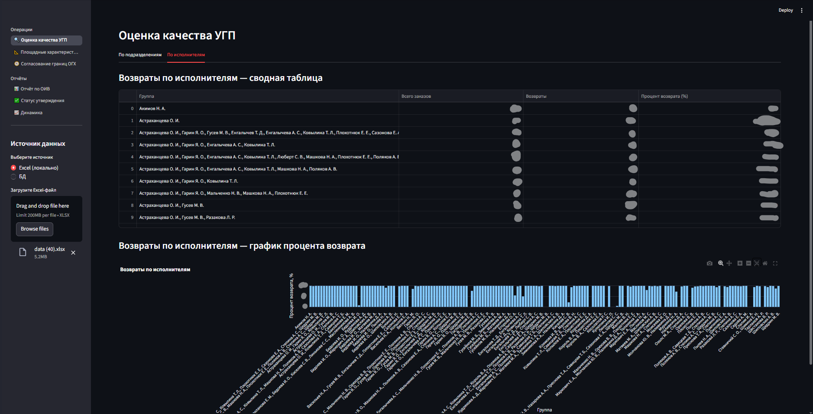
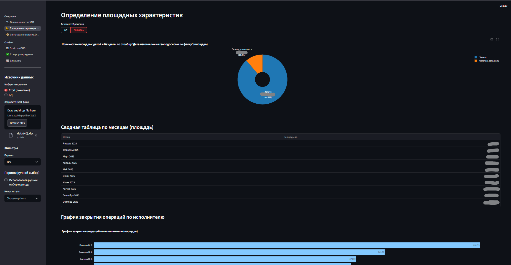
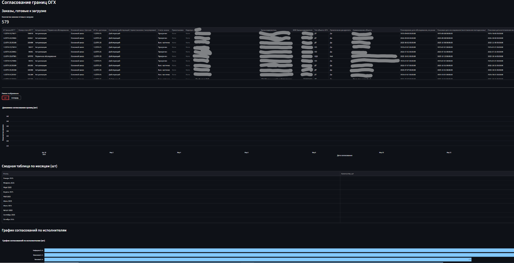
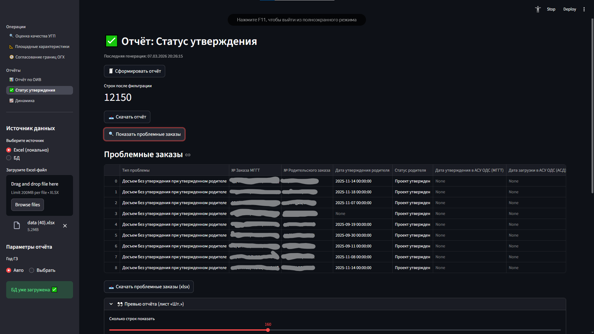
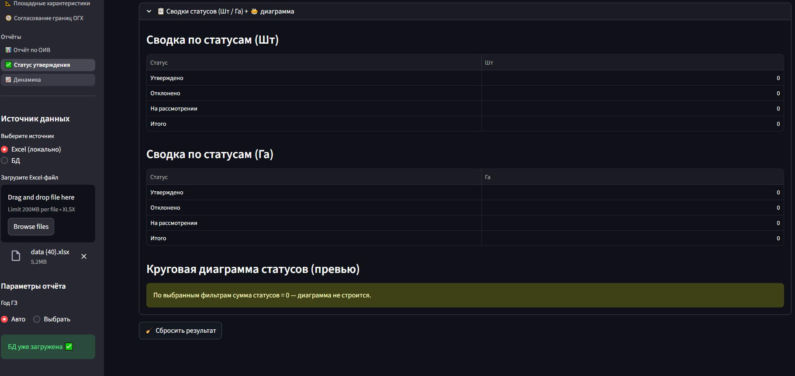
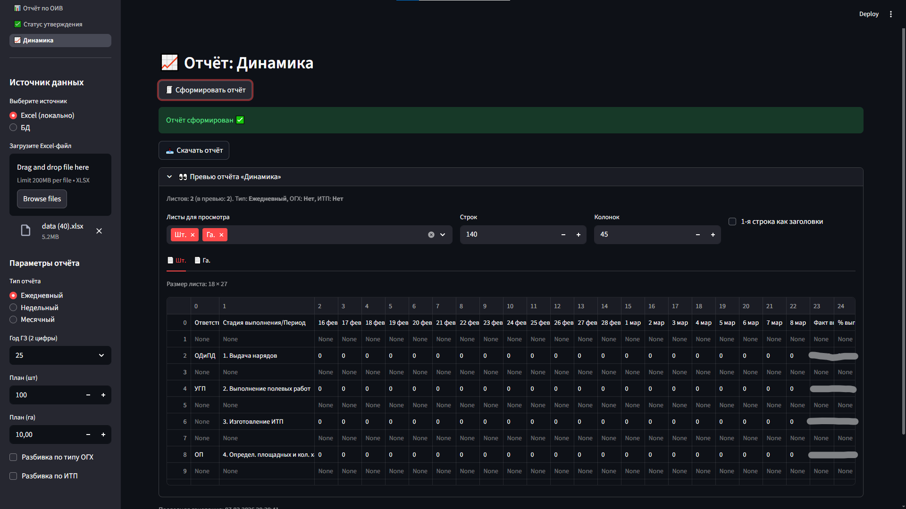
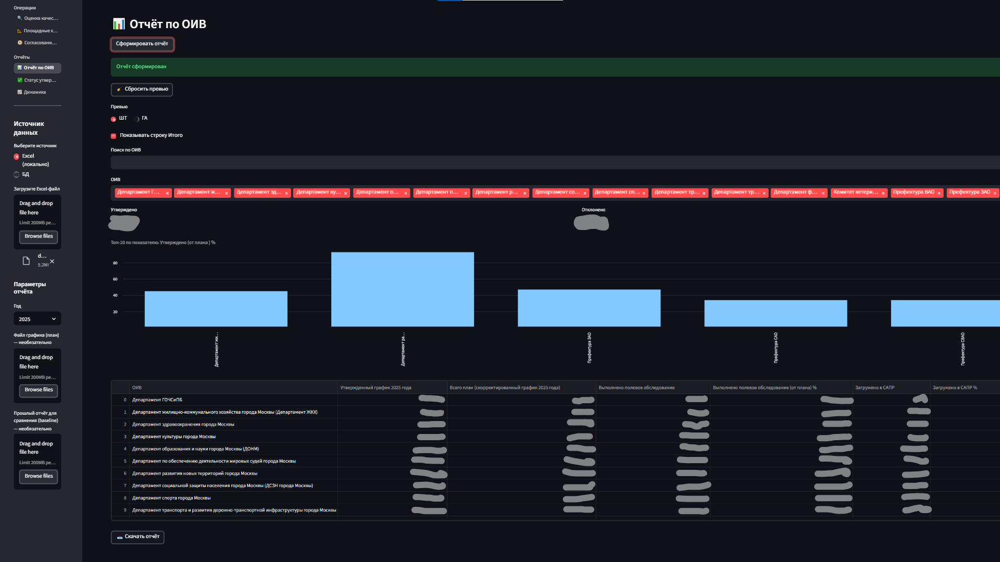

# Streamlit BI Platform

Аналитическая платформа на **Python + Streamlit** для визуализации данных и автоматической генерации аналитических отчётов.

Проект представляет собой модульную систему, позволяющую анализировать операционные данные, отслеживать ключевые показатели и формировать отчёты в Excel.

## Основные возможности

- Многостраничная аналитическая панель (**Streamlit dashboard**)
- Автоматическая генерация **Excel-отчётов**
- Анализ производственных и операционных данных
- Визуализация динамики показателей
- Агрегация и обработка данных с помощью **pandas**
- Модульная архитектура, позволяющая легко расширять систему

## Модули системы

### Оценка качества
Анализ качества производственных данных и контроль корректности обработки заказов.

### Площадные характеристики
Анализ показателей объектов и их количественных характеристик.

### Согласование границ
Контроль и мониторинг процессов согласования границ объектов.

### Статус утверждения
Формирование аналитических отчётов по статусам утверждения заказов с выявлением проблемных записей.

### Динамика
Анализ динамики выполнения операций и визуализация временных рядов.

### Отчёты ОИВ
Формирование специализированных аналитических отчётов для управленческой отчётности.

## Интерфейс приложения

### Оценка качества

### Определение площадных характеристик

## Согласование границ ОГХ

### Статус утверждения

### Динамика выполнения

### Отчёт ОИВ

## Технологии

Проект использует следующий стек:

- Python
- Streamlit
- Pandas
- NumPy
- Matplotlib
- OpenPyXL
- XlsxWriter

## Структура проекта

streamlit-bi-platform
│
├── app.py # основной файл Streamlit приложения
├── requirements.txt
│
├── pages_ # страницы аналитической панели
│
├── approval_status # модуль анализа статусов утверждения
│
├── dynamics # генерация динамических отчётов
│
├── OIV # модуль отчётов ОИВ
│
└── util.py # загрузка и подготовка данных

## Запуск проекта

Установить зависимости:

- pip install -r requirements.txt

Запустить приложение:

streamlit run app.py

## Примечание

Доступ к корпоративной базе данных в публичной версии проекта отключён.  
Репозиторий демонстрирует архитектуру системы, аналитическую логику и генерацию отчётов.

## Автор
 Ярченко Кирилл
Проект демонстрирует разработку аналитических инструментов на Python для автоматизации отчётности, анализа данных и построения интерактивных BI-панелей.

